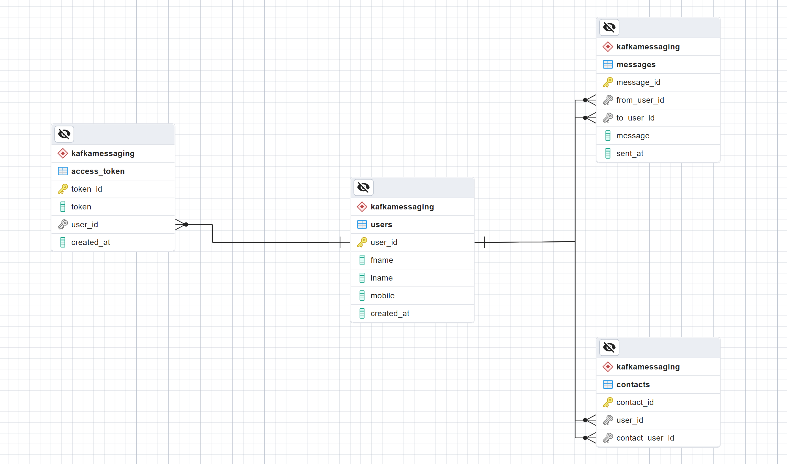

## Refer

[1] dependencies: https://www.endpointdev.com/blog/2020/04/messaging-app-spring-kafka-pt-one/

[2] https://www.endpointdev.com/blog/2020/04/messaging-app-spring-kafka-pt-two/

[3] https://www.endpointdev.com/blog/2020/05/messaging-app-spring-kafka-pt-three/

## Step 2

- Kafka & Docker & Zookeeper
  1. create `docker-compose.yml`
  2. run: `docker-compose up -d`
  3. run: `docker exec -it <kafka container id> sh`  goto: `cd opt/kafka_2.13-2.8.1/bin`
  4. create topic: `kafka-topics.sh --create --zookeeper zookeeper:2181 --replication-factor 1 --partitions 1 --topic test-topic0719`
  5. list topic: `kafka-topics.sh --list --bootstrap-server localhost:9092`
  6. running producer: `kafka-console-producer.sh --topic test-topic0719 --bootstrap-server localhost:9092`  sending message
  7. open a new console, **repeate step 3** and run consumer: `kafka-console-consumer.sh --topic test-topic0719 --from-beginning --bootstrap-server localhost:9092` the messages from producer will be received.

- Consumer Configuration in Spring Project 
  1. using `@KafkaListener` to define `MyKafkaConsumer` in Spring project.
  2. define `MyKafkaProducer`
  3. add `application.properties`

- Postgre Config

- Redis Config
  1. start Redis: `sudo service redis-server start` enter password
  2. `redis-cli`

## Step 3

create basic enetities & their impl

1. We’re not going to integrate the cache environment as Spring persistent data, so we won’t be using the CrudRepository implementation for the cache repository
2. Activation and Authentication
3. Activation is a one-time process to activate a mobile number for our messaging service client. After an activation our simple authentication service will provide an access token to messaging client, and this access token will be used for future client logins. To achieve these simple processes we need to create our authentication service interface.

## Postgre Database

1. Postgre database  

2. Kafka Producer-Consumer Messaging sending  

   