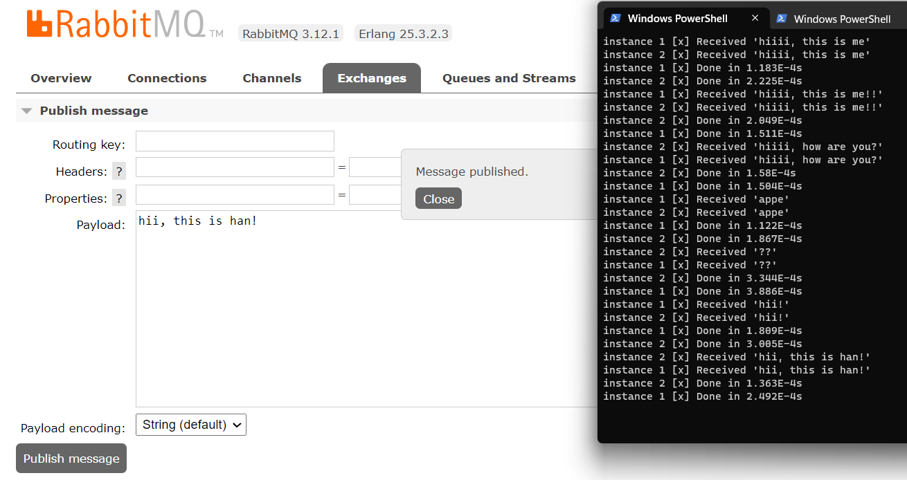

# refer
[1] Publish/Subscribe: https://www.rabbitmq.com/tutorials/tutorial-three-spring-amqp.html

[2] Github: https://github.com/rabbitmq/rabbitmq-tutorials/blob/main/spring-amqp/src/main/java/org/springframework/amqp/tutorials/tut3/Tut3Sender.java

[3] Message Model Guide: https://hevodata.com/learn/rabbitmq-exchange-type/#producer

# small change
```	
<groupId>com.prac</groupId>
<artifactId>rabbitMQ</artifactId>
<version>0.0.2-SNAPSHOT</version>
<name>rabbitMQ</name>
<description>Demo project for Spring Boot</description>
```

# running
1. `./mvn clean package`
2. `docker run -it --rm --name rabbitmq -p 5672:5672 -p 15672:15672 rabbitmq:3.12-management`
 3. `java -jar target/rabbitMQ-0.0.2-SNAPSHOT.jar --spring.profiles.active=pub-sub,receiver --tutorial.client.duration=60000`

4. `java -jar target/rabbitMQ-0.0.2-SNAPSHOT.jar --spring.profiles.active=pub-sub,sender --tutorial.client.duration=60000`

5. send message in http://localhost:15672/#/exchanges/%2F/tut.fanout 
   

# Exchange - Message model

- Producer never sends any messages directly to a queue. Producer doesn't even know if a message will be delivered to any queue at all
- producer can only send messages to an exchange. 
- exchange types: direct, topic, headers and fanout
A producer is a user application that sends messages.
A queue is a buffer that stores messages.
A consumer is a user application that receives messages.
