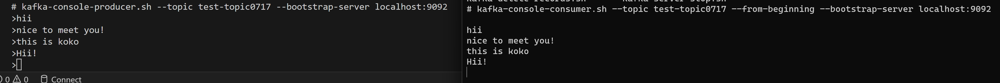

1. running RabbitMQ: `docker run -it --rm --name rabbitmq -p 5672:5672 -p 15672:15672 rabbitmq:3.12-management`

2. create springBoot producer & consumer

3. create `docker-compose.yml`

4. run: `docker-compose up -d`

5. run:  `docker exec -it <kafka container id> sh`
   goto: `cd opt/kafka_2.13-2.8.1/bin` 

6. create topic: `kafka-topics.sh --create --zookeeper zookeeper:2181 --replication-factor 1 --partitions 1 --topic test-topic0717`

7. running producer: `kafka-console-producer.sh --topic test-topic0717 --bootstrap-server localhost:9092`

8. open a new console, **repeate step 5** and run consumer: `kafka-console-consumer.sh --topic test-topic0717 --from-beginning --bootstrap-server localhost:9092`

## output
