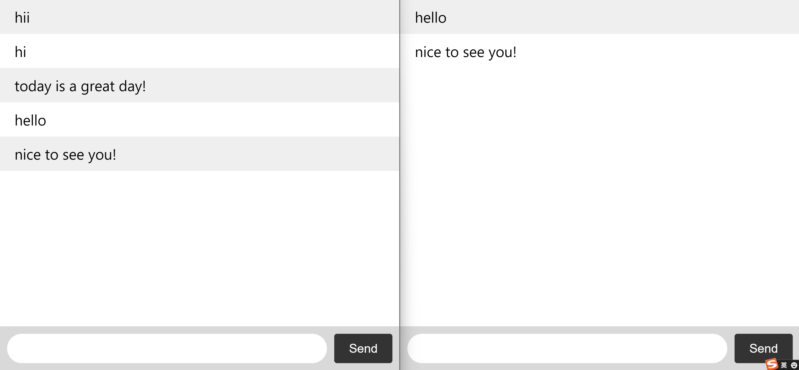

## refer
[1] Socket.IO_chat application: https://socket.io/get-started/chat

[2] Github: https://github.com/socketio/chat-example

[3] Spring Boot Netty Socket.IO Example: https://medium.com/folksdev/spring-boot-netty-socket-io-example-3f21fcc1147d

[4] Github: https://github.com/gurkanucar/demo-socketio

[5] Socket.IO basic: https://climbtheladder.com/socket-io-interview-questions/

## running
1. `node index.js`
2. `npm install express@4`
3. `npm install socket.io`
4. `node index.js`
5. go to : `http://localhost:3000/`

## result

## basic
Socket.IO:
- Socket.IO is a JavaScript library that provides real-time, bi-directional communication between web clients and servers. It has two parts: a client-side library that runs in the browser, and a server-side library for Node.js. Socket.IO is event-driven and uses a publish/subscribe model.

WebSockets V.s Ajax polling
- WebSockets provide a full-duplex connection between a client and a server, meaning that both sides can send and receive data at the same time
- Ajax polling is a technique used to simulate a full-duplex connection over a half-duplex connection
  - With Ajax polling, the client sends a request to the server, 
  - and the server then responds with any new data that it has. 
  - This process is then repeated at regular intervals, giving the illusion of a full-duplex connection.

`acknowledge`: make sure that messages aren’t lost when using Socket.IO
- `acknowledge` allows the server to confirm that a message has been received by the client. If the client does not receive a confirmation, it will assume that the message was lost and will resend 

`ACK`
- An ACK is a message sent by a Socket.IO client to confirm that it has received a message from the server. This is used to ensure that messages are delivered reliably.

`ACK callback function`
- The ACK callback function is used to confirm that a message has been received by the server. This is important in ensuring that messages are not lost in transmission.

Why would I need to use clustering or load balancing with Socket.IO?
- `Clustering` is a way of `horizontally scaling` a Node.JS application by sharing the load between multiple processes or servers
- This can be useful if you are expecting a large number of concurrent connections to your Socket.IO application
- `Load balancing` is a way of **distributing the traffic across multiple servers** to help improve performance and reduce the risk of overloading a single server.

`socket.io.sockets.emit()`
-  to broadcast messages to all connected clients from outside the context of a connection handler