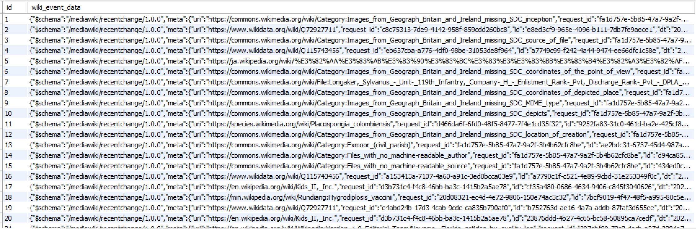

# Wiki-real-time-logs

this project save the wiki-real-time changes data into MySQL databse using Kafka Producer-Consumer module <br>
wiki url: https://stream.wikimedia.org/v2/stream/recentchange

## Step
1. create Wiki Producer & Consumer
2. in Consumer `application.properties` file,  add `?sessionVariables=sql_mode='NO_ENGINE_SUBSTITUTION'&jdbcCompliantTruncation=false` into `spring.datasource.url`
    > spring.datasource.url=jdbc:mysql://localhost:3306/wikidata?sessionVariables=sql_mode='NO_ENGINE_SUBSTITUTION'&jdbcCompliantTruncation=false

    to avoid the `SQL Error: 1406, SQLState: 22001 Data truncation: Data too long for column 'wiki_event_data' at row 1` ERROR


## result
1. Producer:


2. Consumer:


3. Database: 



    sample data
    ```
    {"$schema":"/mediawiki/recentchange/1.0.0","meta":{"uri":"https://lt.wikipedia.org/wiki/Chapelton_Maroons_FC","request_id":"7af80b21-f7fb-483c-9d0a-a1e20c398970","id":"3b541935-ac0a-4da1-b21c-68e5deafed92","dt":"2023-07-18T02:34:35Z","domain":"lt.wikipedia.org","stream":"mediawiki.recentchange","topic":"eqiad.mediawiki.recentchange","partition":0,"offset":4792990580},"id":14217046,"type":"new","namespace":0,"title":"Chapelton Maroons FC","title_url":"https://lt.wikipedia.org/wiki/Chapelton_Maroons_FC","comment":"Naujas puslapis: {{fc-info |image    = [[Vaizdas:Chapelton Maroons FC logo.png|200px]] |clubname = Chapelton Maroons FC |fullname = Chapelton Maroons Football Club |nickname =  |founded  = [[1991 m.]]  |ground   = ''W Park'' stadionas, [[Čapeltonas]] |capacity = 000 |chairman = {{vlv|Jamaika}} {{small|nežinoma}} |manager  = {{vlv|Jamaika}} {{small|nežinoma}} |league   = [[Premier lyga (Jamaika)|Premier lyga]] |season   = 2022–2023 |position =   }}  '''Chapelton Maroons Football Club'''...","timestamp":1689647675,"user":"Makenzis","bot":false,"notify_url":"https://lt.wikipedia.org/w/index.php?oldid=7006079&rcid=14217046","minor":false,"patrolled":false,"length":{"new":9230},"revision":{"new":7006079},"server_url":"https://lt.wikipedia.org","server_name":"lt.wikipedia.org","server_script_path":"/w","wiki":"ltwiki","parsedcomment":"Naujas puslapis: {{fc-info |image    = <a href=\"/w/index.php?title=Vaizdas:Chapelton_Maroons_FC_logo.png&amp;action=edit&amp;redlink=1\" class=\"new\" title=\"Vaizdas:Chapelton Maroons FC logo.png (puslapis neegzistuoja)\">200px</a> |clubname = Chapelton Maroons FC |fullname = Chapelton Maroons Football Club |nickname =  |founded  = <a href=\"/wiki/1991_m.\" title=\"1991 m.\">1991 m.</a>  |ground   = &#039;&#039;W Park&#039;&#039; stadionas, <a href=\"/w/index.php?title=%C4%8Capeltonas&amp;action=edit&amp;redlink=1\" class=\"new\" title=\"Čapeltonas (puslapis neegzistuoja)\">Čapeltonas</a> |capacity = 000 |chairman = {{vlv|Jamaika}} {{small|nežinoma}} |manager  = {{vlv|Jamaika}} {{small|nežinoma}} |league   = <a href=\"/wiki/Premier_lyga_(Jamaika)\" title=\"Premier lyga (Jamaika)\">Premier lyga</a> |season   = 2022–2023 |position =   }}  &#039;&#039;&#039;Chapelton Maroons Football Club&#039;&#039;&#039;..."}
    ```
