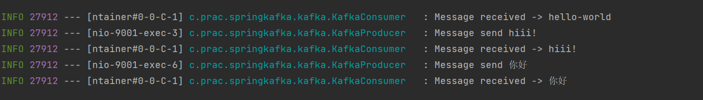

# String Message Sending
## Step
1. create `docker-compose.yml`
2. run `docker-compose up -d`
3. create spring project

## Test

http://localhost:9001/api/v1/kafka/publish?message=hello-world

http://localhost:9001/api/v1/kafka/publish?message=你好

## Output

# Json Message Sending
## Step

## Test

## Output
