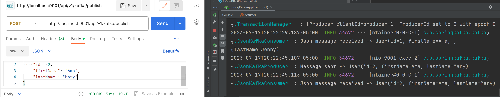

# String Message Sending
## Step
1. create `docker-compose.yml`
2. run `docker-compose up -d`
3. create spring project

## Test

http://localhost:9001/api/v1/kafka/publish?message=hello-world

http://localhost:9001/api/v1/kafka/publish?message=你好

## Output


# Json Message Sending
## Step

1. Create Class: `JsonMessageController`
2. `JsonKafkaProducer`
3. `JsonKafkaConsumer`
4. application.properties: `spring.kafka.consumer.value-deserializer=org.springframework.kafka.support.serializer.JsonDeserializer` 
5. application.properties: `spring.kafka.producer.value-serializer=org.springframework.kafka.support.serializer.JsonSerializer`

## Test
http://localhost:9001/api/v1/kafka/publish

```
{
    "id": 1,
    "firstName": "Ama",
    "lastName": "Jenny"
}
```

## Output
